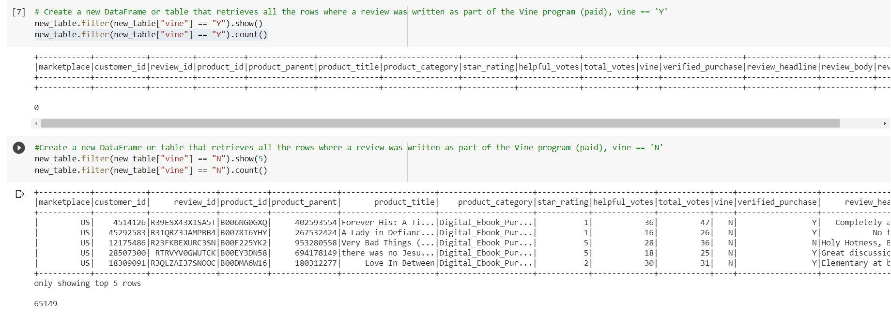
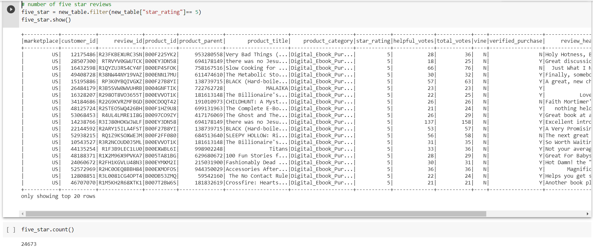
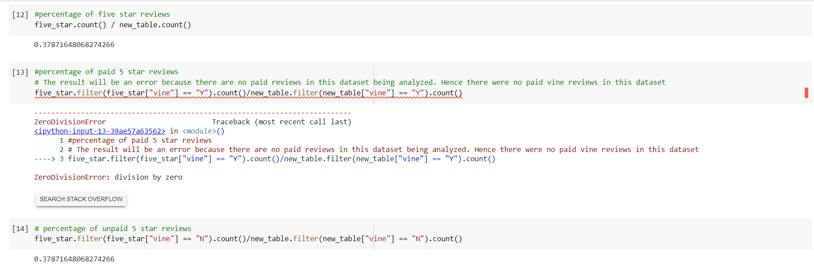

# Amazon_Vine_Analysis

## Overview of the analysis
For this project was I picked a dataset from amazon reviews on US Digital Ebook Reviews and used Pyspark to perform ETL process to extract the dataset, transform the data, connect to an AWS RDS instance, and load the transformed data into pgAdmin. Next I used PySpark and performed analysis to determine if there was any favorable review bias from the vine members from the chosen dataset. 

## Results 
### How many Vine reviews and non-Vine reviews were there in the dataset?

- There were no vine reviews in our dataset, and a total of 65,149 non-Vine reviews in the dataset.

  
  
### How many Vine reviews were 5 stars? How many non-Vine reviews were 5 stars?
- Since there were no Vine reviews in my dataset, hence we cannot determine how many vine reviews were 5 star. 
- Since all the reviews in our dataset were non-Vine reviews, all the 5 star reviews in our dataset where non-vine reviews and the total was 24,673 5-star reviews. 

  
  
### What percentage of Vine reviews were 5 stars? What percentage of non-Vine reviews were 5 stars?

- Since there were no vine reviews in the dataset and no 5 star vine reviews as a result we cannot determine the percentge of Vine reviews that were 5 stars.
- Since all the 5 star reviews of the dataset belonged to non-Vine reviews, the percentage of non-Vine reviews or the data set as a whole with 5 star reviews are 37.87%.

  
  
## Summary
The dataset that I analyzed for this project does not have any Vine reviews(paid reviews), hence I could not determine from any metrics from the analyzed dataset what percentage of the reviews were from Vine(paid) program participants. I was able to deduce that all the 5 star reviews were from non-Vine(unpaid) customers and the percentage of 5 star reviews from them were 37.87%. As a result I cannot conclude whether any positivity bias for reviews in the Vine Program. To perform any additional analysis on my dataset, I would need data from Vine Participants who left a review for Ebook Purchases(this dataset) and from there I can accurately find the metric on percentage of 5 star reviews from Vine Participants to conclude my findings. 
